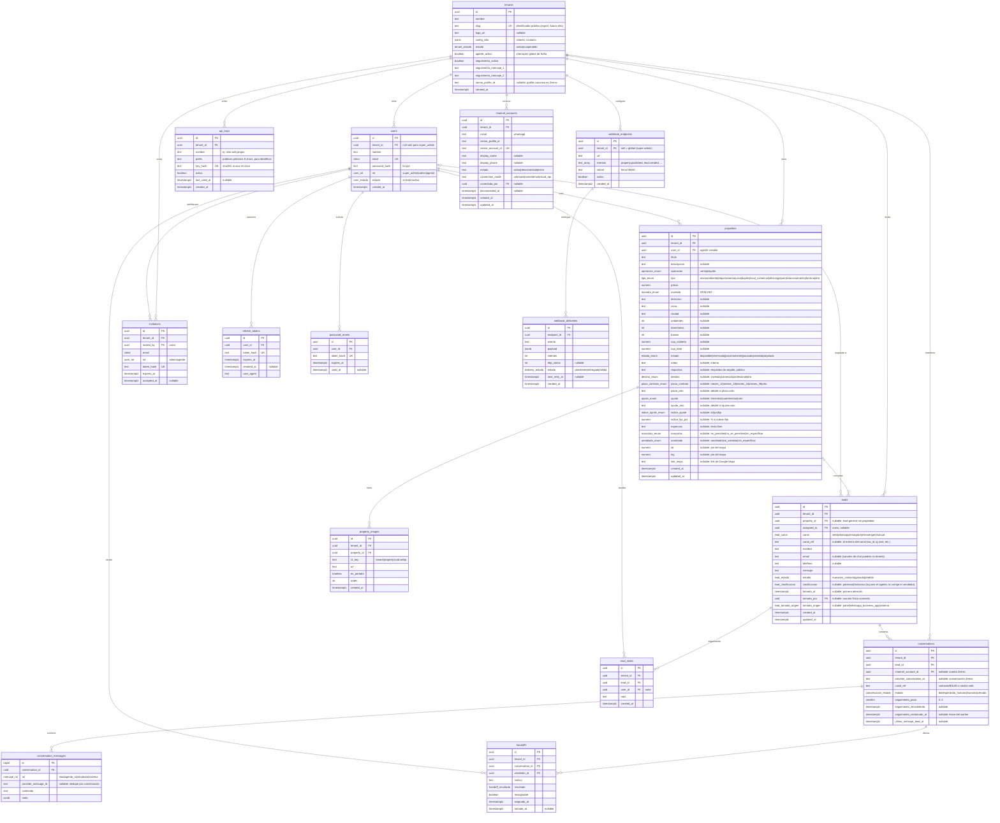

# Diagrama ER — Plataforma Inmobiliaria (Backend VPS)

**Referencia:** `arquitectura.md` §4 · Convención: nombres de columnas de negocio en español (consistente con el MVP actual).

## Diagrama

## Reglas del modelo

1. **`tenant_id` NOT NULL** en toda tabla de negocio (excepción: `users.tenant_id` nullable solo para super admins de Koi Studio; `webhook_endpoints.tenant_id` nullable para hooks globales de plataforma).
2. **Índices compuestos que empiezan por `tenant_id`:** `(tenant_id, created_at desc)` y `(tenant_id, estado)` en properties; `(tenant_id, estado)` y `(tenant_id, canal)` en leads; `(tenant_id, email)` en users; etc.
3. **Enums de Postgres** para todos los campos de estado (mismos valores que el MVP actual + los nuevos `user_rol`, `lead_canal`, `lead_estado`).
4. **Obligatorios de propiedad sin cambios:** solo `titulo`, `operacion`, `tipo`, `precio` (regla 6 del MVP). **Sin flujo de aprobación:** la propiedad es visible públicamente desde el alta (decisión de producto — sin fricción, igual que el MVP). Los campos de alquiler (`destino`, `plazo_contrato`, `ajuste`, `indice_ajuste`, `expensas`, `mascotas`, `amoblado`, `requisitos`) y de mapa (`lat`, `lng`, `link_maps`) son todos opcionales; `tipo` y `estado` se ampliaron (ver la entidad). Migración `20260814000000_property_alquiler`.
5. **Nunca se guardan tokens/keys en claro:** `invitations`, `refresh_tokens`, `password_resets` y `api_keys` almacenan hash (SHA-256). Las API keys muestran solo `prefix` después de la creación.
6. **CRM multicanal:** `web` y `manual` crean leads desde formularios/panel; WhatsApp entra mediante Zernio y Sofía. `instagram` y `messenger` existen en el enum de leads, pero todavía no tienen conector ni conversación implementada.
7. **`updated_at`** por trigger (reutilizar el del MVP). Borrado de propiedad → cascade a `property_images` + limpieza de objetos R2 (en el service, no en la BD). `leads.property_id` con `ON DELETE SET NULL` (el lead sobrevive a la propiedad).
8. **Compatibilidad de migración:** `properties` es la misma tabla del schema Supabase actual + `link_maps`; `property_images` agrega `tenant_id` y `r2_key` — el import de Lamelas es directo.
9. **Sin `subscriptions` ni `tenant_domains` por ahora** (billing y dominios custom fuera de alcance). Se agregan por migración cuando toque; nada del modelo actual las asume.
10. **Seguimiento durable:** el paso y vencimiento viven en `conversations`; el claim evita que dos réplicas procesen la misma etapa. Un handoff con `reasignable=false` queda fuera del timeout normal. Migración `20260914000000_whatsapp_followups`.
